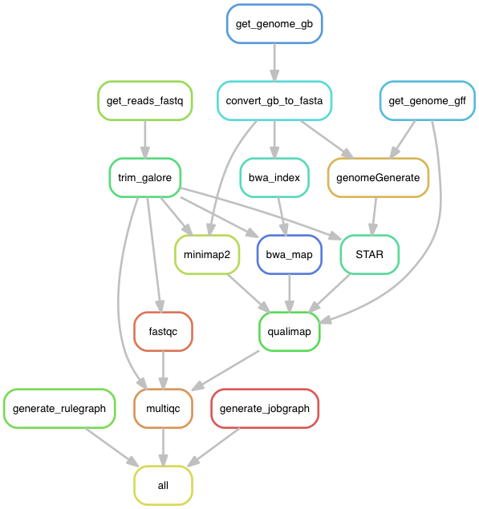

# VirusMap

VirusMap is a RNA-seq analysis tool built using snakemake. I tried using Magic-Blast to look for reads in the SRA, but the connection is not stable for searching large datasets. VirusMap will download reads and map locally. Aligment is performed by SRA with a specifc target genome. I'll probally go back to Magic-Blast for more general local searches.

## Directed acyclic graph aka the pipeline

## Setup

$ `bash setup.sh`

## Downloading data

- curl is backup
- fasta-dump freaked out and downloaded 32Gb of data instead of the 4Gb reads...
- biopython - it's python

## Run

Set `SRA_IDS` and `VIRAL_GENBANK_IDS` in Snakefile

$ `snakemake`

## More info

The ncbi has a good SnakeMake tutorial <https://nbis-reproducible-research.readthedocs.io/en/latest/snakemake/>